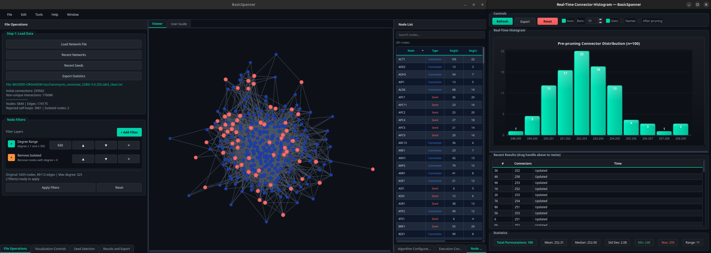

::: {.hero-banner}
# BasicSpanner
Rapid analysis of networks through extreme graph simplification.  
Given a set of seeds, BasicSpanner computes the *basic network*: the
minimal subgraph that preserves every pairwise distance among the seeds.
:::

{fig-align="center" width="90%"}

## What is a basic network?

A **basic network** is the strictest distance preserver that can be derived
from an undirected graph: an induced subgraph with the minimal number of
units in which the geodesic distances among every pair of selected nodes
(seeds) are exactly the same as in the original graph.

The nodes of a basic network are of two kinds:

- **Seeds**: a predefined set of nodes of interest.
- **Connectors**: the minimal additional nodes required to preserve every
  seed-to-seed geodesic distance.

## Key features

- Computation of basic networks on large undirected graphs.
- Stackable graph filters (degree range, betweenness centrality, largest
  connected component, isolated-node removal, name patterns).
- User-defined or randomly generated seed sets with permutation and batch
  replicates.
- Parallel CPU execution and optional pruning.
- Real-time connector-count histogram with summary statistics.
- Interactive visualization and export in CSV, plain text and Gephi-compatible
  formats.

## Where to go next

::: {layout-ncol=2}

### [Documentation](documentation/index.qmd)
Installation, workflow, algorithmic description and input/output formats.

### [API Reference](api/index.qmd)
Overview of the core, algorithms and GUI modules.

:::

## Citation

If you use BasicSpanner in your work, please cite:

> Marín, J. & Marín, I. (2026). *BasicSpanner*. Zenodo.
> <https://doi.org/10.5281/zenodo.19697430>

BibTeX:

```bibtex
@software{marin_2026_basicspanner,
  author    = {Marín, José and Marín, Ignacio},
  title     = {BasicSpanner},
  month     = apr,
  year      = 2026,
  publisher = {Zenodo},
  doi       = {10.5281/zenodo.19697430},
  url       = {https://doi.org/10.5281/zenodo.19697430}
}
```
